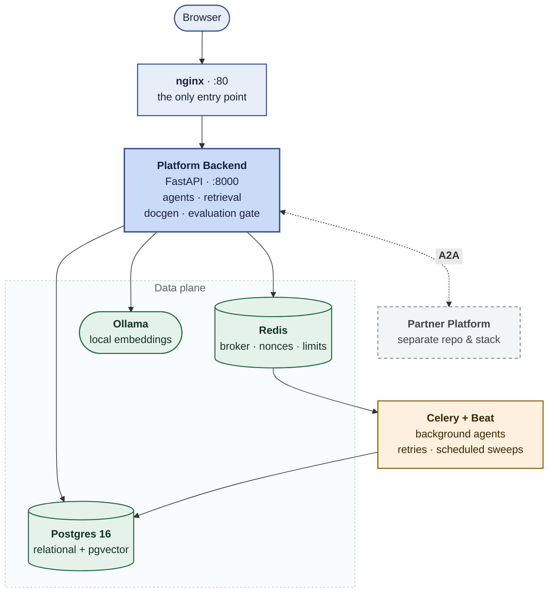

<p align="center">
  <!-- Theme-aware: GitHub swaps these on prefers-color-scheme.
       -light.png is the NAVY wordmark (for light backgrounds);
       -dark.png is the WHITE one (for dark backgrounds). Swapping them
       renders white-on-white and reads as a missing image — see frontend/src/brand.js. -->
  <picture>
    <source media="(prefers-color-scheme: dark)"
            srcset="frontend/src/assets/ATOM-logo-dark.png">
    <source media="(prefers-color-scheme: light)"
            srcset="frontend/src/assets/ATOM-logo-light.png">
    
  </picture>
</p>

<h1 align="center">AtOM</h1>

<p align="center">
  Open-source AI platform for end-to-end specification change management —
  idea, design documents, partner distribution, code generation, and
  certification — with AI agents at every stage and an evaluation gate
  between them.
</p>

<p align="center">

[](https://www.python.org)
[](https://fastapi.tiangolo.com)
[](https://react.dev)
[](https://vite.dev)
[](https://www.postgresql.org)
[](https://docs.celeryq.dev)
[](https://docs.docker.com/compose/)
[](LICENSE)
[](CONTRIBUTING.md)

</p>

---

## Overview

AtOM — **Agentic Task Orchestration & Management** — is a full-stack,
production-grade platform for the whole life of a specification change: an idea
becomes research, design documents and schemas; those go out to the
organisations that must implement them; their questions come back; code is
generated against a real repository; and the result is certified. Each stage is
an AI agent, and each hands to the next only after an evaluation gate passes.

- 📝 **Authoring pipeline** — one prompt becomes deep research, a product canvas,
  a requirements document, a technical specification, XSD schemas, an explainer
  deck and certification test cases
- 🤝 **Partner distribution over A2A** — artifacts ship to registered partners on
  Google's Agent-to-Agent protocol, with a negotiation loop and per-partner
  implementation status
- 🧠 **Retrieval-grounded generation** — hybrid BM25 + pgvector search over an
  ingested corpus and over the target codebase, so agents cite files they
  actually read
- 🛠️ **Code generation against a real repo** — plan, edit, review, repair and a
  real Maven build, with a human opening the merge request
- 🔍 **Governance review stages** — uploaded skill bundles run as review agents
  in a sandbox, producing a must-fix gate before code advances
- ✅ **Certification** — an A2A conversation with a partner's bank agent, driving
  switch-level test cases through simulators
- 🔒 **Eight independent security layers** on the A2A boundary — TLS, JWT, HMAC
  envelopes, mTLS, CIDR allow-lists, rate limits, audit trail and key lifecycle

### Domain support

The platform was built for a payments ecosystem, where a central body publishes
a change and many banks and payment providers must implement it. Domain
vocabulary is being moved behind a pluggable **domain pack** (`DOMAIN_PACK`,
default `network`) so other ecosystems can use it. Until that work lands, some
generated prose is payments-specific — see `backend/app/packs/` for the
interface and `CONTRIBUTING.md` for how to add a pack.

---

## Architecture

Eight services in the default stack, behind a single nginx front door:



The partner platform — the receiving side of every change — lives in its own
repository and runs as its own stack:
<https://github.com/npci/atom-partner-platform>. It connects to this platform as
an authenticated A2A client, so nothing about it needs to be deployed here.

A2A traffic across that boundary is signed and authenticated: **HMAC
envelope + Bearer JWT + CIDR allow-list**, with mTLS in the production overlay.

Certification simulators (`certagent/`, `precert/`) are **separate stacks** with
their own compose files and are not started by the quickstart.

---

## Prerequisites

### Required software

- **Docker** with **Compose v2** — the only supported way to run the full stack
- Roughly **15 GB** of free disk, and 10–20 minutes for the first build

### Required credentials

- **Datastore passwords.** `POSTGRES_PASSWORD`, `REDIS_PASSWORD` and
  `CERTSIM_INTERNAL_TOKEN` have **no defaults**. Compose declares them as
  `${VAR:?...}` and refuses to start without them — a datastore password with a
  published default is a datastore with no password. Step 1 below sets all
  three.
- **An LLM provider key.** The stack starts without one, but every AI feature
  fails on authentication. One of `ANTHROPIC_API_KEY`, `OPENAI_API_KEY`, or an
  internal gateway key. Step 2.

Nothing else. There are no certificates or partner credentials to obtain for a
local stack.

---

## Quick Start

**1. Clone and configure**

```bash
git clone <this-repo> && cd atom-network-platform

# Root .env — datastore credentials, read by docker-compose.yml
cp .env.example .env          # then edit: set POSTGRES_PASSWORD and REDIS_PASSWORD

# Backend .env — the ~100 application settings
cp backend/.env.example backend/.env
```

Two env files, and both are needed. The root `.env` is what Compose
interpolates into `docker-compose.yml`; `backend/.env` is handed to the
backend, celery and celery_beat containers as their environment.

**2. Add an LLM key**

```bash
# backend/.env
LLM_PROVIDER=claude          # claude | openai | ainxt | ollama
ANTHROPIC_API_KEY=sk-ant-...
```

**3. Create the shared docker network**

```bash
docker network create certagent_cert-net
```

The backend, celery and celery_beat services attach to this network so they can
reach a certification agent when one is deployed. It is declared `external`, so
Compose expects it to already exist and will refuse to start with
*"network certagent_cert-net declared as external, but could not be found"*.
Creating it empty is enough for a local stack.

**4. Start the stack**

```bash
docker compose up -d --build
```

Eight services. The first build takes 10–20 minutes. Migrations run
automatically — the backend's command is `alembic upgrade head` followed by
uvicorn.

**5. Create the first admin user**

```bash
docker compose exec backend python seed.py
```

Prints the generated password once. Set `ADMIN_EMAIL` and `ADMIN_PASSWORD`
beforehand to choose your own; re-running is a no-op if the user exists.

**6. Open the apps**

| App | URL |
|---|---|
| Platform | <http://localhost/a2a/> |

The partner platform is a separate stack from its own repository and is not
started here. To exercise a full change round-trip, clone
<https://github.com/npci/atom-partner-platform>, bring it up, and point it at
this instance from its Settings UI.

**7. Log in**

Use the credentials printed by step 5. The login shows a CAPTCHA; for a local
loop set `CAPTCHA_ENABLED=false` in `backend/.env` and restart the backend —
leave it on anywhere others can reach.

Six roles exist — `product_owner`, `product_manager`, `tech_lead`,
`infosec_reviewer`, `risk_reviewer` and `admin`. Create further users from
**Admin → User Management**.

**Change the seeded password.**

```bash
docker compose run --rm -v "$(pwd)/backend/scripts:/app/bscripts" backend \
  python /app/bscripts/reset_password.py <admin-email> --password '<new>'
```

**8. Run the tests**

```bash
docker compose run --rm backend pytest          # platform (~3,500 tests)
bash scripts/ci/sync-a2a-core.sh --check        # vendored wire code matches canonical
bash scripts/ci/hygiene-check.sh                # secrets, internal hosts, marks, links
```

CI runs the same three on every push — see `.github/workflows/`. The hygiene
gate currently reports broken documentation links and is advisory there; the
other two are blocking.

---

## Project Structure

```
backend/              Platform backend (FastAPI)
  app/agents/           ~100 LLM agents, one module per agent
  app/prompts/          Externalised prompt text (.md), loaded not hardcoded
  app/rag/              Hybrid retrieval: BM25 + pgvector, code + document ingest
  app/docgen/           LangGraph .docx pipeline
  app/a2a_common/       A2A wire code — GENERATED, see packages/a2a-core
  app/packs/            Domain packs (vocabulary behind an interface)
frontend/             Platform UI (React 19 + Vite)
packages/a2a-core/    Canonical A2A wire code, vendored into each service
scripts/ci/           Hygiene, dependency-audit and sync gates
docs/                 Setup guides, runbooks, plans, design records
```

### Related repositories

| Repository | What it is |
|---|---|
| [atom-partner-platform](https://github.com/npci/atom-partner-platform) | The receiving side — reference base code partners fork to consume changes over A2A and plug in their own agents |


---

## Development

```bash
docker compose up -d --build backend           # after dependency changes
docker compose restart nginx                   # after recreating any backend
docker compose run --rm backend alembic upgrade head
```

Live-editing `backend/app/**` requires a local `docker-compose.override.yml`
bind mount — it is gitignored and absent by default. 

Dependencies are **hash-locked**: images install from
`requirements.<arch>.lock` with `--require-hashes`, so editing
`requirements.txt` alone changes nothing until the lock is regenerated. Each
lock's header carries the command.

- [`wiki/`](wiki/) — architecture, workflow phases, retrieval, the evaluation
  gate and the A2A wire, each with a verified-at stamp
 — conventions, build patterns, and a gotcha index
- [`docs/`](docs/) — setup guides, runbooks, and the genericization plan

---

## Capabilities and Limits

Stated plainly, because a platform that generates code invites assumptions:

- **It does not deploy.** `PHASE_B_RUNNER_MODE=build` compiles the target
  repository and stops, reporting the artifacts the build actually produced.
  `ssh`/`local` run an operator-supplied deploy script. `demo` is fully
  simulated and labelled as such in every log line it emits.
- **Prompt injection is mitigated, not solved.** Ingested specifications and
  uploaded documents are untrusted input. See [`SECURITY.md`](SECURITY.md).
- **Output quality is measured, not assumed** — but the golden-output suite
  ships with two captured cases, covering two of the 125 tracked prompts. The
  harness lives in `backend/tests/golden/`.
- **The sandboxed `bash` tool requires Docker.** Where no daemon is reachable it
  refuses rather than falling back to an unisolated subprocess.

---

## Troubleshooting

| Symptom | Cause and fix |
|---|---|
| `network certagent_cert-net ... not found` | The certagent stack owns that network. `docker compose -f certagent/docker-compose.yml up -d` first. |
| `502 Bad Gateway` after rebuilding a backend | nginx caches upstream DNS at startup. `docker compose restart nginx`. |
| Every AI feature returns an auth error | No LLM key. See Quick Start step 2. |
| A `backend/app/**` edit has no effect | `app/` is baked into the image unless you add the override bind mount   |
| A test edit has no effect | `backend/tests/` is baked, not mounted. Rebuild, or `docker cp` the file in. |
| `pip ... hashes do not match` on build | The lockfile is stale, or you are building a different architecture. Regenerate — see the lock header. |
| Retrieval scores 0 for everything | The corpus is empty, or the embedding model was never pulled: `docker exec atom_ollama ollama pull nomic-embed-text`. |

---

## Documentation

| Document | What it covers |
|---|---|
| [`USER_GUIDE.md`](USER_GUIDE.md) | Using the platform, role by role, from idea to certification |
| [`DEPLOYMENT_GUIDE.md`](DEPLOYMENT_GUIDE.md) | Installation, Docker and native, and production hardening |
| [`CONFIGURATION.md`](CONFIGURATION.md) | How configuration works, and which layer wins |
| [`FAQ.md`](FAQ.md) | Why questions the Troubleshooting table does not answer |
| [`CHANGELOG.md`](CHANGELOG.md) | Release history |
| [`wiki/`](wiki/) | Architecture, workflow phases, retrieval, the evaluation gate, the A2A wire |
| [`CONTRIBUTING.md`](CONTRIBUTING.md) | How to contribute, DCO sign-off, coding standards |
| [`SECURITY.md`](SECURITY.md) | Reporting a vulnerability, and the security posture |

---

## Contributing

We welcome contributions! Please read the following before submitting a pull
request:

- [CONTRIBUTING.md](CONTRIBUTING.md) — how to get started, commit guidelines,
  DCO sign-off, and coding standards
- [CODE_OF_CONDUCT.md](CODE_OF_CONDUCT.md) — our community standards
- [GOVERNANCE.md](GOVERNANCE.md) — how decisions are made and who the
  maintainers are
- [SECURITY.md](SECURITY.md) — how to report a vulnerability

Every change must pass `bash scripts/ci/hygiene-check.sh`, which gates secrets,
personal data, third-party marks, generated-file drift and dependency-lock
freshness.

All contributors are listed in [AUTHORS.md](AUTHORS.md).

---

## Licence

MIT License — see [`LICENSE`](LICENSE).

[`NOTICE`](NOTICE) is not required by MIT and is kept anyway: it is where this
project discharges the attribution its own dependencies require.

The licence covers code, not trademarks: see [`TRADEMARKS.md`](TRADEMARKS.md).
Third-party dependency licences are recorded in [`NOTICE`](NOTICE).

---

## Governance

AtOM is a single-vendor open-source project sponsored by the
National Payments Corporation of India (the Authority). See
[GOVERNANCE.md](GOVERNANCE.md) for the full governance model, maintainer list,
and decision-making process.