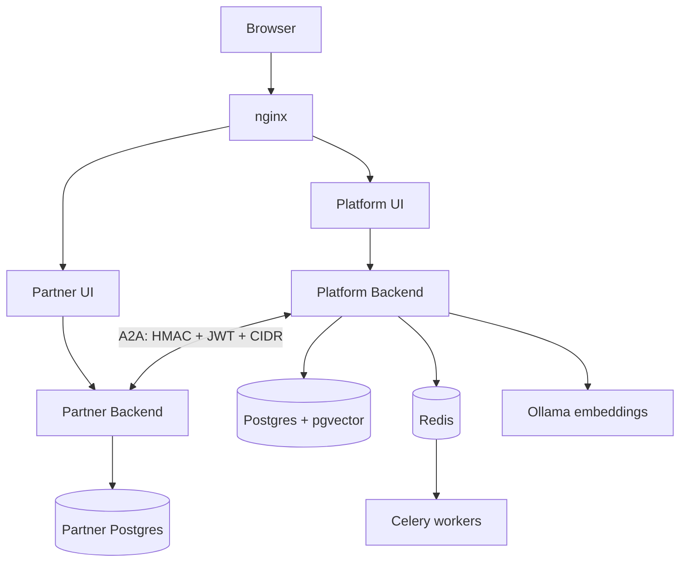

# Platform Wiki

Detailed reference for the architecture, the components, and the code.

This renders natively on GitHub — plain GitHub-flavoured markdown and mermaid,
no site build, no separate wiki repository. It lives in the main repo so a
documentation change ships in the same pull request as the code change it
describes, and so the hygiene gate can see it.

## How this is organised

Pages fall into three kinds, and the difference matters when you edit one.

| Kind | What it is | Editing rule |
|---|---|---|
| **Reference** | Hand-derived from live code | Edit to correct it, then re-stamp; each page names the command that re-derives it |
| **Explanation** | Hand-written narrative | Edit freely; carries a verified-at stamp |
| **Canonical elsewhere** | Already documented in the repo | Link to it; never copy it here |

The third rule is the one that gets broken. Copying a section here creates a
second version that disagrees with the first the next time either changes — a
hand-copied licence summary that ended up contradicting `LICENSE` is how this
rule was learned. When something is already written down, link to it.

## Reference (generated)

| Page | Contents | Derived from |
|---|---|---|
| [Agent catalogue](reference/agents.md) | Every agent module and its model-routing purpose | `llm_router.py` + `app/agents/` |
| [HTTP API](reference/api.md) | Every mounted operation, grouped by tag | the live OpenAPI schema |
| [Data model](reference/data-model.md) | Every table, column, and foreign key | SQLAlchemy metadata |

These are read out of the running application, not parsed from source, so a
conditionally-mounted router appears exactly as it is actually served. They are
deterministic: regenerating without changing code produces a byte-identical
file, which is what lets CI treat "regenerate and diff" as a staleness check.

## Architecture at a glance

The certification stacks run as separate compose projects and are deliberately
not started by the quickstart.

## Explanation (hand-written)

| Page | What it covers |
|---|---|
| [Architecture](architecture.md) | The two platforms, the front door, the A2A boundary, background work |
| [Workflow phases](workflow-phases.md) | The three phases and their state machines, end to end |
| [Security layers](security-layers.md) | The eight layers on the partner boundary, and how to read a rejection |
| [Retrieval](retrieval.md) | Hybrid search, reranking, and how code is ingested differently from prose |
| [Document generation](document-generation.md) | The `.docx` pipeline, and why planning precedes writing |
| [Evaluation gate](evaluation-gate.md) | The four kinds of check between stages, cheapest first |
| [The A2A wire](a2a-wire.md) | Generated wire code, the message vocabulary, and the mistake everyone makes |

Each carries a **verified-at** stamp naming the alembic head and commit it was
checked against. When the stamp no longer matches the tree, distrust the page —
that is what the stamp is for. Without it a page drifts dozens of migrations
behind the schema and still reads as authoritative.

## Already canonical — start here

| Document | Why you would open it |
|---|---|
| [`../README.md`](../README.md) | Project overview, quick start, project structure, and the capability limits |
| [`../backend/README.md`](../backend/README.md) | Backend conventions that fail silently |
| [`../backend/tests/golden/`](../backend/tests/golden/) | How output quality is measured |

## Related repositories

| Repository | Why you would open it |
|---|---|
| [atom-partner-platform](https://github.com/npci/atom-partner-platform) | The receiving side and its agent plug-in contract. Separate repository and stack — this wiki does not describe it |

## Keeping the reference pages honest

There is no generator. The three pages under `reference/` are derived from the
source tree by hand, and each carries, in an HTML comment at the top, the exact
command that re-derives its figures. When you change the code they describe,
run that command, correct the page, and update its verified-at stamp.

A page whose stamp is older than the code it documents is a page to distrust —
that is what the stamp is for.

## Scope limits

The certification simulators are documented at their **interface and runbook
level only**; their internals are deliberately out of scope. They are the
majority of the repository by line count, they are third-party in origin, and an
exposure audit of that tree left findings still unresolved. A walkthrough of
that code would make those findings easier to exploit and risks reproducing
vendor source.
