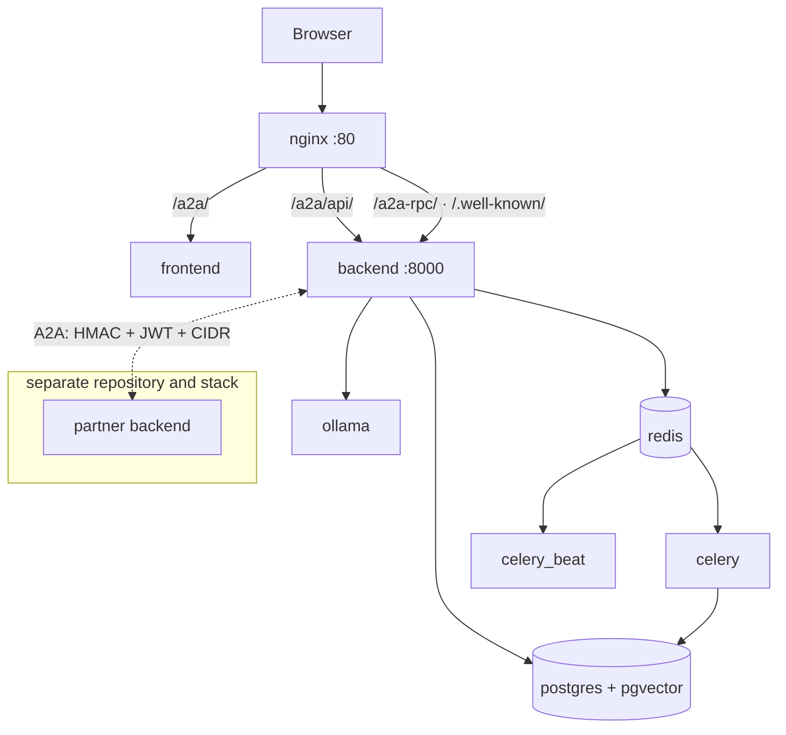

# Architecture

> **Verified at:** alembic head `0138_integration_exchange_query`, commit `e116cea`
> (the partner-platform repository split).
> Checked against `docker-compose.yml`, `backend/app/main.py`,
> `backend/app/a2a_common/__init__.py`, `backend/app/services/celery_tasks.py`.
>
> The routing table is **not** currently verifiable against an nginx config: the
> `nginx/` directory was removed in commit `7326431` and the compose file still
> mounts it. Treat the paths below as intent until that is resolved.
>
> If you change routing, the service list, or the A2A boundary, update this page
> and move the stamp. A stamp that no longer matches is the signal to distrust
> the page — that is what it is for.

## The shape

Two independent platforms that talk to each other over a signed protocol.

The **platform backend** — this repository — is the authoring side: it turns a
prompt into research, design documents, schemas and code, then distributes the
result. The **partner backend** is the receiving side, run by an organisation
that must implement the change. They are separate applications with separate
databases, and they trust each other only through the A2A boundary described
below.

That boundary is now also a **repository boundary**: the partner platform lives
in [its own repository](https://github.com/npci/atom-partner-platform) and runs
as its own stack, reaching this platform as an authenticated A2A client. This
page describes only what is deployed here.

Everything else — the databases, the queue, the embedding server — supports the
platform backend.

## The front door

nginx is the only way in. Nothing else is meant to be reached directly, and in
development the container ports that *are* published exist for debugging, not for
use.

| Path | Goes to | Why it is separate |
|---|---|---|
| `/a2a/` | platform UI | |
| `/a2a/api/` | platform backend | |
| `/a2a/api/ws/` | platform backend | WebSocket upgrade — its own block |
| `/a2a/api/logs/stream` | platform backend | Server-sent events; buffering must be off |
| `/a2a-rpc/` | platform backend | The A2A JSON-RPC wire |
| `/.well-known/` | platform backend | Agent card discovery, unprefixed by design |

The two `.well-known` routes are worth understanding rather than copying. Card
discovery is unprefixed at the root because a remote agent fetches the card
without knowing anything about local path layout — a card published under a
prefix once broke discovery outright.

**After recreating any backend, restart nginx.** It resolves upstream DNS once at
startup, so a recreated container gets a new address and nginx keeps proxying to
the old one, returning 502 until it is restarted. This is the single most common
false alarm in this stack.

## The eight services

| Service | Role |
|---|---|
| `nginx` | Front door; the only published entry point |
| `frontend` | The platform UI |
| `backend` | Authoring, retrieval, code generation, A2A server |
| `celery` | Background work (see below) |
| `celery_beat` | Scheduler for periodic sweeps |
| `postgres` | Platform data **and** the vector index (pgvector) |
| `redis` | Celery broker |
| `ollama` | Local embeddings, so ingestion needs no external API |

The partner backend, its UI and its Postgres are **not** in this list any more —
they belong to the partner platform's own stack.

The certification stacks are **separate compose projects** and are not started by
the quickstart. The root stack joins an external network they own, which is why
they must be up first.

## The A2A boundary

This is the only place the two platforms meet, and it is the part worth reading
carefully — the more so now that they are separate repositories and nothing in
either build can check the other side.

Both backends mount a JSON-RPC endpoint at `/a2a-rpc/rpc` and advertise an agent
card. The shared plumbing wraps Google's `a2a-sdk` so each side implements an
executor rather than re-implementing SDK glue.

Three facts that are easy to get wrong:

- **The wire code is generated, not copied.** `hmac_signer.py`, `protocol.py` and
  `executor_base.py` have exactly one editable source, `packages/a2a-core/`.
  Within this repository `hmac_signer.py` is vendored into **three** trees and
  the other two into **one** (see [the wire](a2a-wire.md)). Editing a copy is
  wasted work: the next sync overwrites it and the hygiene gate fails on drift
  meanwhile. Every service hashes the same wire bytes, so a one-sided edit
  silently breaks signatures across a trust boundary.
- **The partner's copies are outside the gate.** They live in the partner
  repository and are validated by its CI, not this one. A signing change has to
  be landed on both sides as a coordinated release; if it is not, both test
  suites still pass and the only symptom is a rejected signature on a live call.
- **`client.py` and `mount.py` legitimately differ** per service — one side is the
  authority, the other a peer. They are not vendored; the gate baselines their
  diff so the gap cannot grow unnoticed.
- **The partner's mount is best-effort.** It is wrapped in a try/except on import
  and logs a warning if `a2a-sdk` is unimportable, continuing without the
  endpoint. A partner that appears healthy but answers nothing on `/a2a-rpc/` is
  showing you that warning in its startup log.

Authentication is layered, and each layer is independently debuggable: **TLS,
JWT, HMAC envelope, mTLS, CIDR allow-list, rate limit, audit trail, key
lifecycle**.  Production adds TLS and mTLS through a separate nginx configuration; the
development configuration deliberately has neither, so a fresh clone runs without
operator-supplied certificates.

## Background work

Anything slow or scheduled runs in Celery rather than in a request. `celery_beat`
drives the periodic sweeps — retrying failed A2A deliveries, ageing partner
secrets, sweeping orphaned jobs and silent negotiation acceptances, recovering
interrupted agentic runs, and garbage-collecting workspaces.

The pattern to notice: **the system assumes deliveries fail and runs recover.**
Retry and recovery are scheduled jobs, not error handlers.

## Where the AI work lives

The backend is not a CRUD service with an AI feature bolted on; the pipeline is
most of it. Agents are one module each under `app/agents/`, orchestrated as
phases rather than called ad hoc, with an evaluation gate between stages and a
retrieval stack grounding them in an ingested corpus and in real source code.

Model choice is **per-agent purpose**, resolved through a router — never a model
string pinned inside an agent, and never a direct call to a vendor SDK.

## Not covered here

- **Per-agent, per-endpoint and per-table detail** — that is generated:
  [agents](reference/agents.md), [API](reference/api.md),
  [data model](reference/data-model.md).
- **The workflow phases and the security layers in depth** — W2/W3, not yet
  written; .
- **Certification simulator internals** — deliberately out of scope, see
  the scope limits in [`README.md`](README.md).
