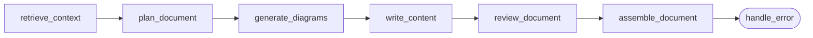

# Document generation

> **Verified at:** alembic head `0138_integration_exchange_query`, commit `e116cea`.
> Node names read from the `StateGraph` construction in
> `backend/app/docgen/agents/pipeline.py`.

Turning approved content into a `.docx` a person will actually open is its own
pipeline, not a formatting step at the end of authoring. It is built as a
LangGraph state graph.

## The pipeline

Six content nodes plus an error handler. The pipeline is mounted as a subgraph,
so a document build is one node inside a larger flow rather than a separate
system.

| Node | Responsibility |
|---|---|
| `retrieve_context` | Pull grounding material for this document |
| `plan_document` | Decide the section structure before writing any prose |
| `generate_diagrams` | Produce the figures |
| `write_content` | Write sections against the plan |
| `review_document` | Check the result before it is assembled |
| `assemble_document` | Build the actual `.docx` |

**Planning precedes writing, and that ordering is the point.** A model asked to
write a long structured document in one pass drifts: sections go missing,
numbering restarts, later sections forget earlier commitments. Planning the
structure first turns one long generation into several short ones with a fixed
contract between them.

**Diagrams are generated before content**, so prose can refer to figures that
exist rather than describing ones that were never produced.

## Document guides

Section structure per document type is declared in `document_guides.py` — the
ontology of what a requirements document, a specification, a circular or a
product note contains.

This file is more load-bearing than it appears. It is:

- what `plan_document` plans against;
- what the deterministic checks assert "mandatory sections present" against;
- and what the certification test-case engine splits a specification on — the
  engine looks up headings emitted here, so **renaming a heading here silently
  changes what the engine can ground on**.

That coupling is real and easy to miss — it has already broken once, when the
engine's heading map was lost and every lookup silently returned nothing.
`backend/tests/api/test_engine_scope_context.py` now asserts those headings still
exist, precisely so a rename here fails loudly instead of quietly starving the
engine.

## Assembly

A `.docx` builder handles headers, footers, classification marks and styling.
Content and presentation are separated: the writing nodes produce structured
content, and assembly decides how it looks. A model that emits Word formatting
inline produces something that renders differently every run.

## Where it can go wrong quietly

- **A missing section is not always an error.** Fallback content exists, so a
  document assembles even when a section could not be produced. That is the right
  default for a long pipeline — and it means a document can be *complete* and
  *thin* at once. The deterministic checks in the
  [evaluation gate](evaluation-gate.md) are what catch that.
- **Truncation does not always announce itself.** Where a provider gateway strips
  the finish marker, detection based on it is structurally blind; sizing each
  agent's output budget to its real output is the mitigation, not finish-reason
  inspection.

## Related

- What feeds it: [retrieval](retrieval.md)
- What checks its output: [evaluation gate](evaluation-gate.md)
- Where documents are produced in the flow: [workflow phases](workflow-phases.md)
