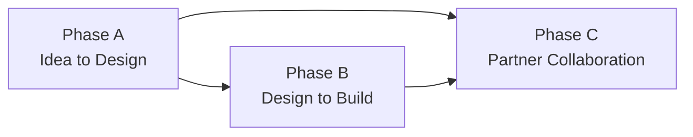

# The three workflow phases

> **Verified at:** alembic head `0138_integration_exchange_query`, commit `e116cea`.
> State values checked against `backend/app/models/change_request.py`,
> `backend/app/models/phase_c.py`, and the agentic run models  .
>
> If a state is added or renamed, update this page and move the stamp.

A change moves through three phases. They are sequential in practice but
independently re-runnable: Phase C can be replayed against an existing Phase A
result without redoing the authoring, which is what the reset scripts in
`scripts/` exist for.



Phase B and Phase C both consume Phase A's output. A change can go to partners
without code having been generated, which is why the arrow forks.

## Phase A — Idea to Design

A prompt becomes a set of approved documents. The state machine is
`ChangeStatus`, and it is strictly ordered:

```
prompt_enhancement → research → canvas → clarification → brd
    → tech_spec → xsd → product_kit → completed
```

| State | What it produces |
|---|---|
| `prompt_enhancement` | A sharpened version of the author's prompt |
| `research` | Deep research: market context and regulatory considerations |
| `canvas` | A structured product canvas |
| `clarification` | Questions back to the author, and their answers |
| `brd` | Business requirements, with multi-stakeholder approval |
| `tech_spec` | The technical specification |
| `xsd` | Schema changes |
| `product_kit` | The distributable bundle: documents, FAQ, test cases, circular |
| `completed` | Phase A closed |

Two things about this sequence are worth knowing before you change it.

**`clarification` sits deliberately between `canvas` and `brd`.** The questions
are generated from the canvas and answered before requirements are written, so
the BRD is authored with the answers rather than being patched afterwards.

**Each stage is gated.** An evaluation layer — judge, critic, grounding and
deterministic checks — runs between stages, so a stage does not advance merely
because an agent returned text.

## Phase B — Design to Build

The design becomes code, against a real repository. This runs as an *agentic
run* with its own state machine, separate from `ChangeStatus`:

```
pending → workspace_ready → context_ready → code_change → review
    → completed | failed
```

The steps are: clone and prepare a workspace, assemble retrieval context from
the real codebase, plan and apply edits, then review and repair. A real build
runs at the end.

Two facts that matter operationally:

- **It does not deploy.** The default runner mode is fully simulated and labelled
  as such in every log line it emits. Other modes compile the target repository
  and stop, or run an operator-supplied script. Nothing ships without a human.
- **Runs are recovered, not just retried.** An interrupted run resumes from its
  last recorded phase, and a run that died before recording any phase falls back
  to `pending` rather than dead-ending. A scheduled sweep drives that recovery.

Generated code is never trusted on its own: it is built, reviewed against an
adversarial pass, gated, and a human opens the merge request.

## Phase C — Partner Collaboration & Certification

The result is distributed to the organisations that must implement it, and their
responses come back. This is the only phase that crosses a trust boundary, so it
is the one with a protocol rather than a function call.

Each partner assignment has its own lifecycle — twelve states, tracked per
partner, so one partner being slow does not block another:

```
assigned → communicated → acknowledged → in_progress → ready
    → received → accepted → applied → tested
    → ready_for_certification → certifying → certified
```

Partners also report coarse progress independently (`design_completed`,
`coding_completed`, `testing_completed`), which is what the readiness view uses.

Traffic is typed: **37 task types** on the wire, covering distribution,
acknowledgement, queries and clarifications, progress and readiness, negotiation,
the certification lifecycle, and the integration-testing tunnel. Each type has a direction and an expected
cardinality — "once per change and version", "any, per question" — declared in
one table in the protocol module rather than implied by handler code.

Three mechanisms are easy to miss:

- **Negotiation is a round-based loop**, not a single exchange. Partners can
  counter rollout terms; rounds close on a timer, and a scheduled sweep applies
  **silent acceptance** when a partner does not respond. Silence is a decision
  the system makes explicit, not an absence.
- **Blockers are first-class**, with their own severity and status, so a partner
  can be "in progress but blocked critically" rather than merely late.
- **Delivery assumes failure.** Failed A2A deliveries are retried by a scheduled
  job, not by the request that first attempted them.

Certification then drives switch-level test cases through simulators over the
same protocol, and ends in a sign-off.

## Where the detail lives

- Per-state columns and tables: [data model](reference/data-model.md) — generated.
- The endpoints behind each phase: [API reference](reference/api.md) — generated.
- The agents each stage runs: [agent catalogue](reference/agents.md) — generated.
- The trust boundary Phase C crosses: [security layers](security-layers.md).

